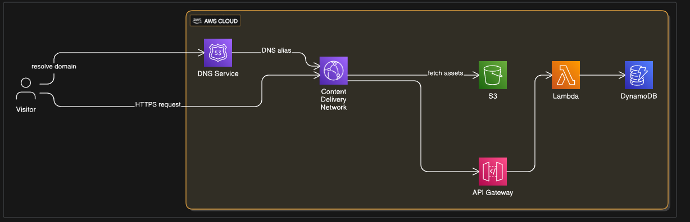

# XayHanmonty's Portfolio

This repository contains the source code for my personal portfolio website.

## About The Project

This is a modern, single-page application designed to showcase my projects, professional experience, and interests. It features a clean user interface with 3D animations and scroll-triggered events to create an engaging user experience.

### Tech Stack

*   **Frontend:** [React](https://react.dev/), [Vite](https://vitejs.dev/), [TypeScript](https://www.typescriptlang.org/)
*   **3D Graphics:** [Three.js](https://threejs.org/) via [@react-three/fiber](https://docs.pmnd.rs/react-three-fiber) and [@react-three/drei](https://github.com/pmndrs/drei)
*   **Styling:** [Tailwind CSS](https://tailwindcss.com/)
*   **Animations:** [Framer Motion](https://www.framer.com/motion/)

## Usage

For detailed instructions on how to set up and run this project locally, please see the [USAGE.md](USAGE.md) file.

## Deployment

This project has two potential deployment configurations:

### 1. GitHub Pages (Currently Active)

The portfolio is automatically built and deployed to GitHub Pages upon every push to the `main` branch. The workflow is defined in `.github/workflows/deploy.yml` and handles everything from dependency installation to final deployment.

### 2. AWS Infrastructure (Available)

The `infra/` directory contains a complete Infrastructure as Code (IaC) setup using [Terraform](https://www.terraform.io/). This configuration will provision a production-grade environment on AWS, including:

*   **Amazon S3:** To host the static website files.
*   **Amazon CloudFront:** To act as a global CDN for low-latency delivery.
*   **Amazon Route 53 & ACM:** To manage a custom domain and SSL certificate.
*   **Amazon DynamoDB**: A NoSQL database service used to store and manage visit counters for the portfolio. The table `xayportfolio_visit_counters` stores `pk` (primary key) and `count` attributes.
*   **AWS Lambda**: A serverless compute service that executes backend logic. The `hello` Lambda function handles requests for `/hello` and `/counter` endpoints. It interacts with DynamoDB to retrieve and increment visit counts.
*   **Amazon API Gateway**: Creates a RESTful API that acts as the front door for applications to access data, business logic, or functionality from backend services. This project uses an HTTP API (`hello-http-api`) with the following routes:
    *   `GET /hello`: A basic endpoint returning a "Hello from Lambda!" message.
    *   `GET /counter`: Retrieves the current visit count.
    *   `POST /counter`: Increments the visit count.