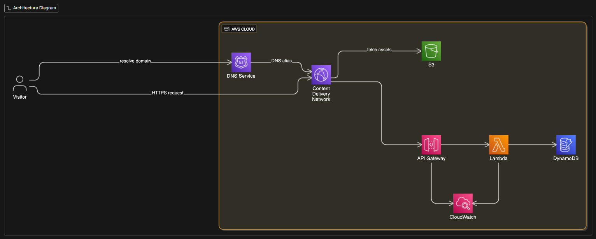

# XayHanmonty's Portfolio

This repository contains the source code for my personal portfolio website.

## About The Project

This is a modern, single-page application designed to showcase my projects, professional experience, and interests. It features a clean user interface with 3D animations and scroll-triggered events to create an engaging user experience.

### Tech Stack

*   **Frontend:** [React](https://react.dev/), [Vite](https://vitejs.dev/), [TypeScript](https://www.typescriptlang.org/)
*   **3D Graphics:** [Three.js](https://threejs.org/) via [@react-three/fiber](https://docs.pmnd.rs/react-three-fiber) and [@react-three/drei](https://github.com/pmndrs/drei)
*   **Styling:** [Tailwind CSS](https://tailwindcss.com/)
*   **Animations:** [Framer Motion](https://www.framer.com/motion/)

## Infrastructure

The `infra` directory contains the Terraform configurations for deploying the backend infrastructure. This includes:

- **AWS Lambda:** Serverless functions for backend logic.
- **API Gateway:** Exposing Lambda functions as RESTful APIs.
- **S3:** Static website hosting and storage.
- **CloudFront:** Content delivery network for global distribution and caching.
- **DynamoDB:** NoSQL database for persistent storage.
- **Route 53:** DNS management for custom domain names.
- **CloudWatch:** Monitoring and logging of the deployed infrastructure.

## Usage

For detailed instructions on how to set up and run this project locally, please see the [USAGE.md](USAGE.md) file.

The project uses GitHub Actions for continuous integration and deployment. The workflows are defined in the `.github/workflows` directories:

- `.github/workflows/deploy.yml` (in `infra`): Deploys the backend infrastructure using Terraform.
- `.github/workflows/deploy.yml` (in `website`): Builds and deploys the frontend website to S3 and CloudFront.
